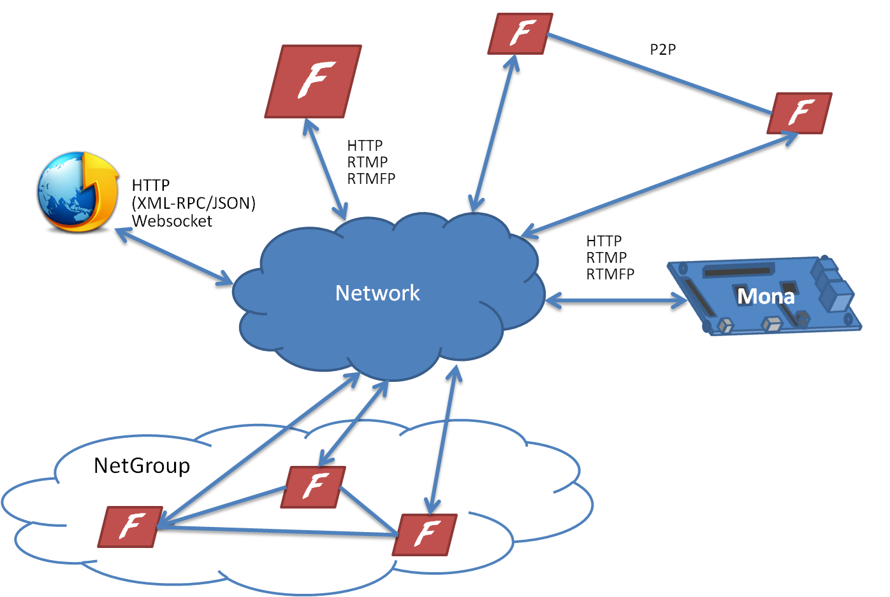

.. Mona documentation master file

Overview
#################################

MonaServer starts with the idea that protocols essentially serve the same aims : 

- pull data (request + response),
- push data (server -> client or client -> server),
- read/write file (**VOD** and **RECORDING**),
- AND communication channel between clients (**P2P** or publish/play **live**).

And with this objective we are proud to give you a generic alternative to existing communication servers with :

- The powerful LuaJIT_ compiler combined in a useful lua API to write server applications,
- **NoSQL** database management system,
- **RTMFP** Protocal, which provide P2P channels, UDP reliable and non-reliable communication and many other great features,
- And all of this developed keeping in mind the 5 following notions: speed, light weight, cross-platform, scalable and elegant **C++11** code.

Mona currently supports the following protocols:

- **RTMFP**, **RTMP**, **RTMPE**,
- **HTTP** (with **JSON-RPC** and XML-RPC_), **Websocket**.

We expect to add many other protocols, such as  **WebRTC**, **HLS**, **IPTV**, but please remember that our development is open source
so contributions are greatly appreciated: `us`_, `eu`_.

Mona is licensed under the `GNU General Public License`_, please contact us for a commercial licence at mathieupoux@gmail.com or jammetthomas@gmail.com.

The following scheme is a little preview of what is possible with MonaServer :

  
For some samples running on a `Raspberry Pi`_ please visit the `Samples page <./samples.html>`_ of our `documentation <./manual.html>`_.

.. _LuaJIT : http://luajit.org/
.. _XML-RPC : http://xmlrpc.scripting.com/spec.html
.. _`GNU General Public License` : http://www.gnu.org/licenses/
.. _`us` : https://www.paypal.com/cgi-bin/webscr?cmd=_s-xclick&hosted_button_id=M24B32EH2GV3A
.. _`eu` : https://www.paypal.com/cgi-bin/webscr?cmd=_s-xclick&hosted_button_id=QPWT9V67YWSGG
.. _`Raspberry Pi` : http://www.raspberrypi.org/