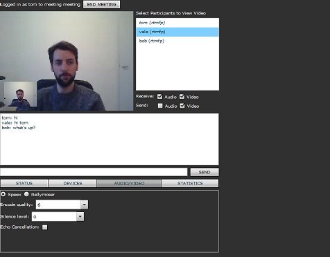
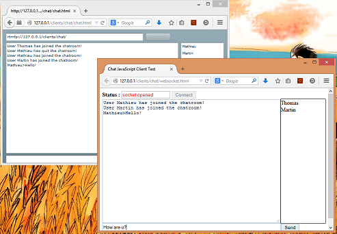
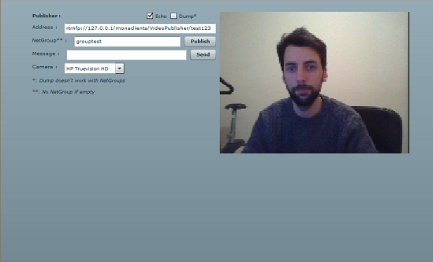

Samples
##############################

All these samples are freely hosted on a `Raspberry Pi`_ to give you a preview of what you could do with MonaServer.
We don't make benefits of these services so if you like them please promote MonaServer by clicking on our social buttons above.
Furthermore you can donate (`$`_, `€`_) to contribute to the development of MonaServer.

The sources are availables on the `MonaClients github page`_.

To get more informations please ask us on the `MonaServer forum`_ or send a mail to jammetthomas@gmail.com.

+-------------------------+-------------------------------------------------------------------+-------------------------------------------------+
| Screenshot & link       |  Description                                                      |   Technologies                                  |
+=========================+===================================================================+=================================================+
| |monavideo|             | MonaVideo_ :                                                      | - **Protocol :** RTMFP                          |
|                         |                                                                   | - **P2P :** Full-mesh                           |
|                         | The simpliest application of live video communication.            |                                                 |
|                         |                                                                   |                                                 |
|                         | 1. Type a name to identify your meeting                           |                                                 |
|                         | 2. Send the http link to your correspondant                       |                                                 |
|                         |                                                                   |                                                 |
|                         | **Notes :**                                                       |                                                 |
|                         |                                                                   |                                                 |
|                         | - This is just a sample, the video quality is set to the minimum  |                                                 |
|                         | - Download the `apk installer`_ to try it on Android.             |                                                 |
+-------------------------+-------------------------------------------------------------------+-------------------------------------------------+
|                         | VideoPhone_ :                                                     |                                                 |
|                         |                                                                   |                                                 |
| |videophone|            | This is an improved version of the `Cirrus Sample Application`_   | - **Protocol :** RTMFP                          |
|                         | with full-screen mode and a better default quality of video.      | - **P2P :** Full-mesh                           |
|                         |                                                                   |                                                 |
+-------------------------+-------------------------------------------------------------------+-------------------------------------------------+
|                         | Meeting_ :                                                        |                                                 |
|                         |                                                                   |                                                 |
| |meeting|               | This is the adaptation of the `Adobe Meeting Sample`_. It is      | - **Protocol :** RTMFP or RTMP                  |
|                         | a more complex VideoConference application permitting to          | - **P2P :** Full-mesh or publish/play           |
|                         | connect users in both RTMFP (P2P full-mesh) and RTMP              |                                                 |
|                         | (publish/play) modes.                                             |                                                 |
|                         |                                                                   |                                                 |
+-------------------------+-------------------------------------------------------------------+-------------------------------------------------+
|                         | FileShare_ :                                                      |                                                 |
|                         |                                                                   |                                                 |
| |fileshare|             | The simpliest application of P2P file sharing.                    | - **Protocol :** RTMFP                          |
|                         |                                                                   | - **P2P :** NetGroup                            |
|                         | 1. Load your file and share the link                              |                                                 |
|                         | 2. Your file is shared as long as their is a peer connected       |                                                 |
+-------------------------+-------------------------------------------------------------------+-------------------------------------------------+
|                         | Chat_ :                                                           |                                                 |
|                         |                                                                   |                                                 |
| |chat|                  | A sample chat application available in :                          | - **Protocol :** WebSocket or RTMFP/RTMP        |
|                         |                                                                   |                                                 |
|                         | - Javascript (WebSocket) : `Javascript Chat`_                     |                                                 |
|                         | - Flash (RTMP/RTMFP) : `Flash Chat`_                              |                                                 |
+-------------------------+-------------------------------------------------------------------+-------------------------------------------------+
|                         | VideoPublisher_ :                                                 |                                                 |
|                         |                                                                   |                                                 |
| |videopublisher|        | A simple video publisher working with both RTMP & RTMFP, with or  | - **Protocol :** RTMFP/RTMP                     |
|                         | without a NetGroup, allows **synchronous recording!**             | - **P2P :** Netgroup                            |
|                         |                                                                   |                                                 |
|                         | **Note :** asynchronous recording is a feature in the roadmap, if | - **Recording :** in a lua synchronous way      |
|                         | you need it please contact us.                                    |                                                 |
+-------------------------+-------------------------------------------------------------------+-------------------------------------------------+
|                         | VideoPlayer_ :                                                    |                                                 |
|                         |                                                                   |                                                 |
| |videoplayer|           | A simple video player working with both RTMP & RTMFP, with or     | - **Protocol :** RTMFP/RTMP or HTTP Progressive |
|                         | without a NetGroup and with HTTP Progressive (only flv)!          | - **P2P :** Netgroup                            |
|                         |                                                                   |                                                 |
|                         | **Note :** HTTP Progressive is a new feature providing an         |                                                 |
|                         | alternative to RTMP & RTMFP, if you are interested to improve it  |                                                 |
|                         | :doc:`contact us <contacts>`!                                     |                                                 |
+-------------------------+-------------------------------------------------------------------+-------------------------------------------------+
|                         | IndustrialComputing_ :                                            | - **Protocol :** WebSocket                      |
|                         |                                                                   | - **SVG/Javascript**                            |
| |icomputing|            | A proof of concept of an Industrial Computing interface using     | - **NoSQL Database**                            |
|                         | SVG for the view and saving data with our NoSQL Dabase system.    |                                                 |
|                         |                                                                   |                                                 |
+-------------------------+-------------------------------------------------------------------+-------------------------------------------------+

  
.. |videophone| image:: img/videophone.png                         
  :target: http://raspi.monaserver.ovh/MonaClients/VideoPhone/
  :width: 250                                        
  :height: 150
  

  
.. |fileshare| image:: img/fileshare.png                         
  :target: http://raspi.monaserver.ovh/MonaClients/FileShare/
  :width: 250                                        
  :height: 150
  

  

  
.. |videoplayer| image:: img/videoplayer.png                         
  :target: http://raspi.monaserver.ovh/MonaClients/VideoPlayer/
  :width: 250                                        
  :height: 150
  
.. |icomputing| image:: img/industrialcomputing.png                         
  :target: http://raspi.monaserver.ovh/MonaClients/IndustrialComputing/
  :width: 250                                        
  :height: 150

.. _MonaVideo : http://raspi.monaserver.ovh/MonaClients/MonaVideo/
.. _VideoPhone : http://raspi.monaserver.ovh/MonaClients/VideoPhone/
.. _Meeting : http://raspi.monaserver.ovh/MonaClients/Meeting/
.. _FileShare : http://raspi.monaserver.ovh/MonaClients/FileShare/
.. _Chat : http://raspi.monaserver.ovh/MonaClients/chat/
.. _VideoPublisher : http://raspi.monaserver.ovh/MonaClients/VideoPublisher/
.. _VideoPlayer : http://raspi.monaserver.ovh/MonaClients/VideoPlayer/
.. _IndustrialComputing : http://raspi.monaserver.ovh/MonaClients/IndustrialComputing/
.. _`Javascript Chat`: http://raspi.monaserver.ovh/MonaClients/chat/websocket.html
.. _`Flash Chat`: http://raspi.monaserver.ovh/MonaClients/chat/chat.html
.. _`Adobe Meeting Sample` : http://www.adobe.com/devnet/flashmediaserver/articles/real-time-collaboration.html
.. _`Cirrus Sample Application` : http://labs.adobe.com/technologies/cirrus/samples/
.. _`$` : https://www.paypal.com/cgi-bin/webscr?cmd=_s-xclick&hosted_button_id=VXMEGJ2MFVP4C
.. _`€` : https://www.paypal.com/cgi-bin/webscr?cmd=_s-xclick&hosted_button_id=LW2NA26CNLS6G
.. _`MonaServer forum` : https://groups.google.com/forum/#!forum/monaserver
.. _`MonaClients github page` : https://github.com/MonaSolutions/MonaClients
.. _`Raspberry Pi` : http://www.raspberrypi.org/
.. _`apk installer` : http://raspi.monaserver.ovh/MonaClients/MonaVideo/MonaCam.apk
